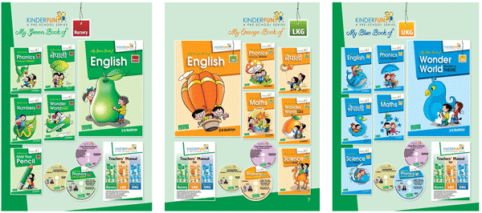

The KINDERFUN pre-school series is an innovative Kindergarten series comprising a set of books (set books) for three levels – Nursery (Foundation), Lower Kindergarten (LKG) and Upper Kindergarten (UKG), serving children aged from three to six. This series is a complete pre-school kit of more than sixteen books packaged attractively in three separate sets for each level-GREEN, ORANGE and BLUE. The series has been published by GREEN BOOKS, Lalitpur.

  

The books of each set deal with language skills (reading, writing, listening and speaking), number skills, general environmental awareness, sensory practice activities; and together, these books provide a comprehensive introduction to pre-reading, pre-writing and number skills; language development, and cognitive awareness for each level.

The reading and practice materials of the series have been carefully graded and put in order, showing practical consideration of children’s age, psychology and the findings about how children develop their reading skills. The series offers a variety of activities, stories, songs, games, and handson projects designed to engage children fully in the learning process.

**The series has been prepared following three important factors:**

- the latest developments in education that develop children’s creative skills for ‘21st Century Learning’,
- the principles of the Montessori Method of teaching and reading, and
- the framework of the Early Childhood Development (ECD) Curriculum prescribed by Department of Education of Nepal.

We are thankful to the whole team of GREEN Books Pvt Ltd for making positive contributions to the success of this KINDERFUN series project, and making the books available all over the country.
